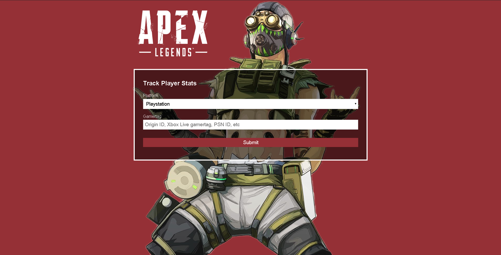

# Apex Tracker App
> Track Apex Legends player stats by platform.

Heroku hosted app that renders the stats of an Apex Legend player. User specifies platform and gamer id to search. Renders selected data from tracker.gg api with the help of Vue.js and Lifecycle hooks. This project also uses Express.js, Node.js and concurrently to link the front and back end. I had a lot of fun learning this one!

Link to deployed project https://pokemon-memory-app.herokuapp.com/#/
